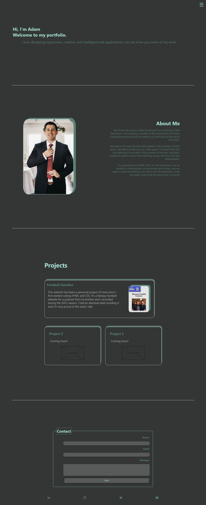

# portfolio-website

## Description
This is my web portfolio for potential employers to view. The main goal of building this application was to house a central location for all of my best work to be displayed. 

## Installation
There is no installation required for this project. Just follow the URL for the webpage and you can view the code in the inspector for the DevTools.

## Usage
Go to the following URL to view the live site https://adamhood15.github.io/portfolio-website/ . Below is a screenshot of the finished product. 

## Credits
I am the sole collaborator on this project. Link icons at the bottom of the footer were downloaded from Font Awesome.

## License
Please refer to the license in the repo.